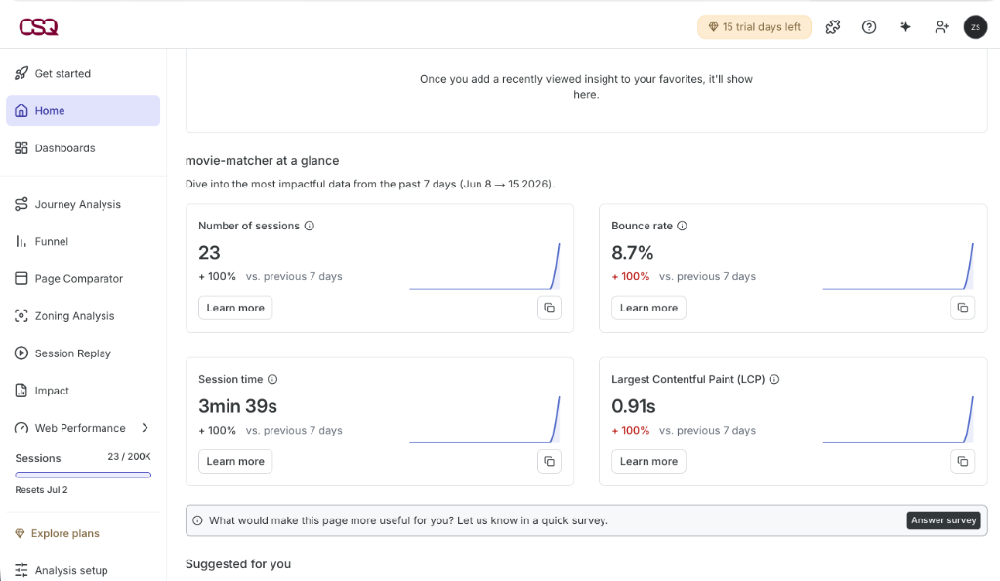
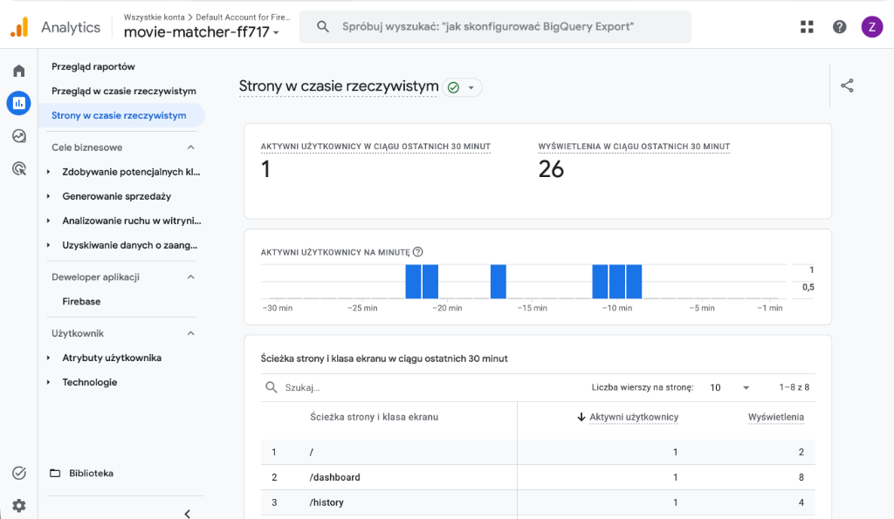
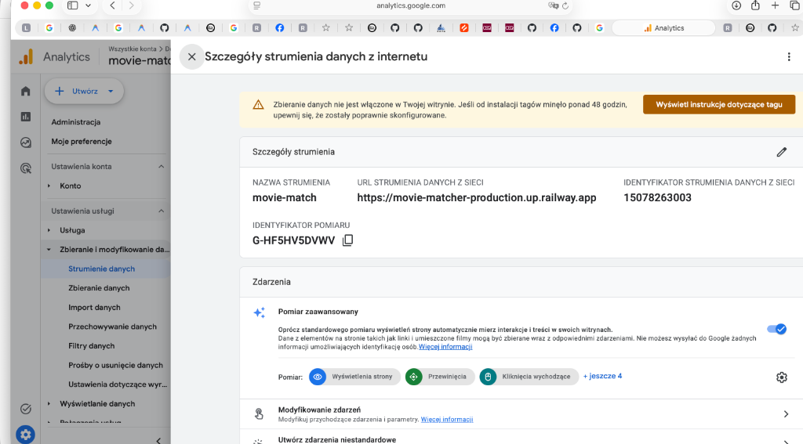
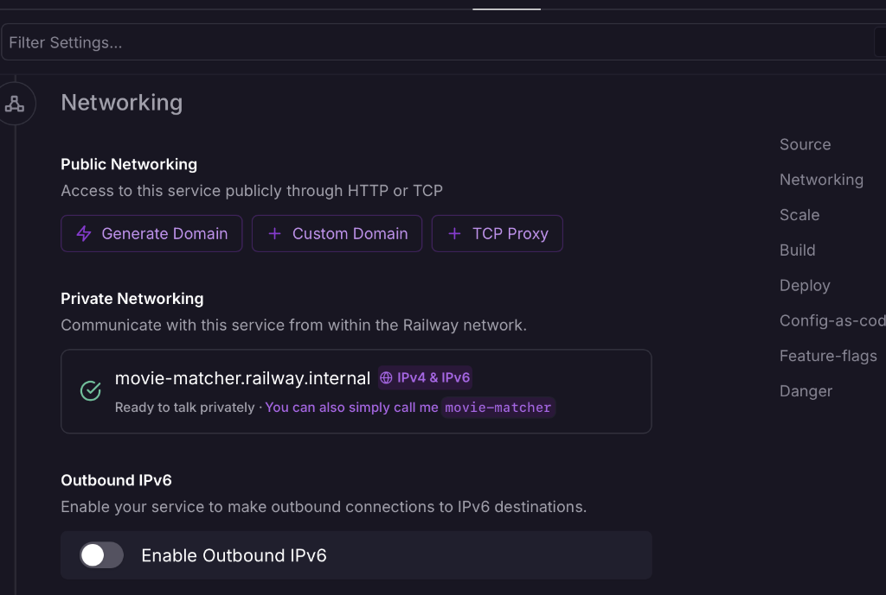
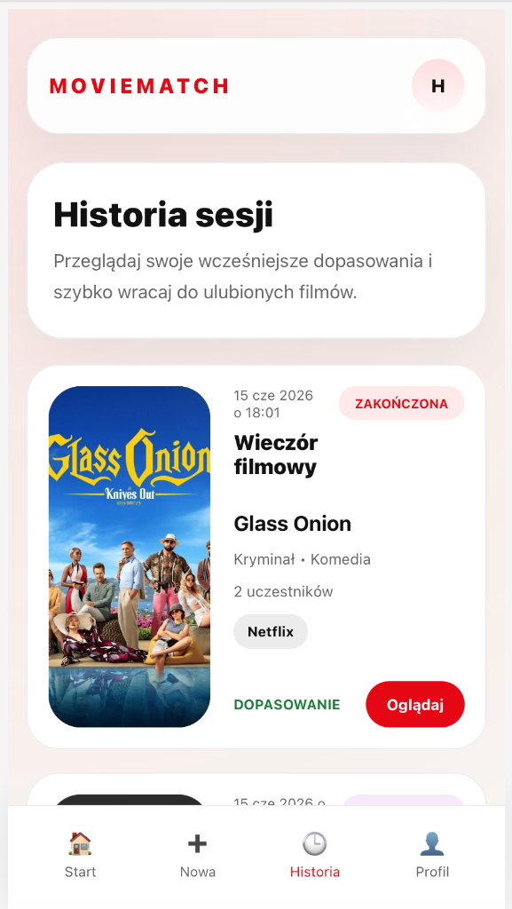

# Movie Matcher

Webowe narzędzie do demokratycznego wyboru filmu w grupach znajomych. Uczestnicy sesji swipują karty filmów, a aplikacja wykrywa wspólny wybór (match) i podaje link do streamingu.

## Struktura projektu

```
movie-matcher/
├── frontend/        # Aplikacja React + Vite
└── backend/         # Mock serwer Express (API)
```

## Wymagania

- Node.js >= 18
- npm >= 9

## Instalacja

```bash
# Sklonuj repozytorium
git clone <url-repo>
cd movie-matcher

# Zainstaluj zależności we wszystkich pakietach jednocześnie
npm run install:all
```

## Konfiguracja środowiska

Skopiuj plik przykładowy i uzupełnij klucze:

```bash
cp frontend/.env.example frontend/.env.local
```

Otwórz `frontend/.env.local` i uzupełnij:

```env
VITE_HOTJAR_SITE_ID=<twoje-site-id>        # https://www.hotjar.com
VITE_GA_MEASUREMENT_ID=G-XXXXXXXXXX        # https://analytics.google.com
```

> Bez tych kluczy aplikacja działa normalnie — Hotjar i GA są po prostu nieaktywne.

## Uruchomienie

### Oba serwisy naraz (zalecane)

```bash
npm run dev
```

Uruchamia równolegle:
- **Frontend** → http://localhost:5173
- **Backend** → http://localhost:3001

### Osobno

```bash
npm run frontend   # tylko Vite dev server
npm run backend    # tylko Express mock server
```

## Dostępne endpointy API

| Metoda | Ścieżka | Opis |
|--------|---------|------|
| `GET` | `/api/movies` | Lista filmów (filtry: `platforms`, `genres`, `yearFrom`, `yearTo`) |
| `GET` | `/api/movies/:id` | Szczegóły jednego filmu |
| `POST` | `/api/sessions` | Utwórz sesję `{ hostName, name, filters }` |
| `GET` | `/api/sessions/:id` | Pobierz sesję |
| `POST` | `/api/sessions/:id/join` | Dołącz do sesji `{ participantName }` |
| `POST` | `/api/sessions/:id/start` | Host startuje głosowanie |
| `POST` | `/api/sessions/:id/vote` | Głos `{ participantId, movieId, action: 'like'|'skip' }` |
| `GET` | `/api/sessions/:id/result` | Wynik sesji (matched movie + runner-upy) |

## Skrypty (frontend)

```bash
cd frontend

npm run dev            # dev server
npm run build          # build produkcyjny do dist/
npm run preview        # podgląd buildu produkcyjnego
npm run lint           # ESLint
npm run lint:fix       # ESLint z auto-fix
npm run format         # Prettier (nadpisuje pliki)
npm run format:check   # Prettier (tylko sprawdza, nie zmienia)
```

## Skrypty (backend)

```bash
cd backend

npm run dev            # node --watch (hot reload)
npm start              # node (bez hot reload)
```

## Technologie

| Warstwa | Technologia |
|---------|------------|
| Frontend | React 18, Vite, React Router v7 |
| Stylowanie | CSS Modules |
| Analityka | Google Analytics 4 (react-ga4), Hotjar |
| Backend (mock) | Express, cors |
| Jakość kodu | ESLint (flat config), Prettier |
| Uruchamianie | concurrently |

## Przepływ użytkownika

```
Splash → Login → Setup Session → Lobby → Swiping → Match Result
                                                ↓
                                         Movie Detail (sheet)

Dashboard → Session History
         → User Profile
```

## Wdrożenie i Analityka

Aplikacja została wdrożona w modelu monolitycznym (serwer Express serwujący statyczne pliki React SPA) na platformie **Railway**:
- URL produkcyjny: [https://movie-matcher-production.up.railway.app](https://movie-matcher-production.up.railway.app)

### Integracje i Śledzenie Ruchu

Aplikacja posiada zintegrowane dwa wiodące narzędzia analityczne pozwalające badać zachowanie użytkowników w czasie rzeczywistym i analizować ich ścieżki:

1. **Google Analytics 4 (GA4)**:
   - Śledzenie odsłon zintegrowane z routerem React Router (`react-ga4` + dedykowany `AnalyticsListener`).
   - Dynamiczny pomiar aktywnych użytkowników na podstronach SPA (`/dashboard`, `/history`, `/setup` itp.).
2. **Contentsquare (Hotjar)**:
   - Nagrania wideo z sesji użytkowników (Session Replay) oraz mapy cieplne.
   - Monitorowanie wskaźników wydajnościowych (LCP, Bounce Rate).

---

### Zrzuty ekranu z działania i analityki

#### 1. Panel Contentsquare (Hotjar)
Zrzut ekranu prezentuje przetworzone sesje użytkowników z wskaźnikami czasu trwania sesji oraz Core Web Vitals:



#### 2. Panel Google Analytics 4 (GA4)
Zrzut ekranu pokazuje sekcję Czasu Rzeczywistego w GA4, rejestrującą aktywnych użytkowników oraz odsłony podstron SPA:



#### 3. Interfejs Aplikacji (Movie Matcher)
Poniższe zrzuty prezentują wygląd aplikacji:




